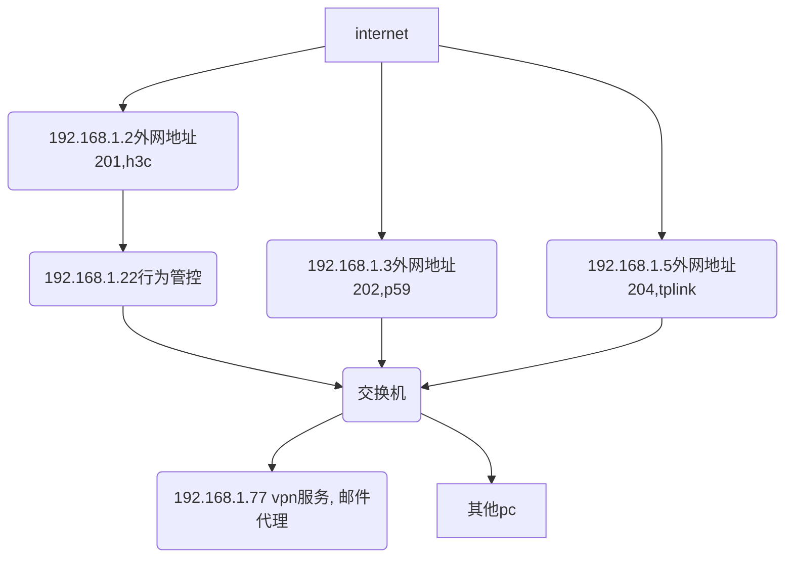

## 当前网络拓扑

## 各交换机密码

地址 | 帐号 | 密码
-----|-----|------
192.168.1.2 | admin | 2660@qq.com
192.168.1.22 | super | 2660@qq.com
192.168.1.3 | tozed  | 123@abc
192.168.1.5 | admin  | admin

## 当前状态
- 两类用户，一种是可以上网，一种不能上网，但可以收公司邮件。
- 1.3 上设置了白名单，只有测试机器和另外需要端口映射的机器允许使用。
- 1.5 已经关闭，再验证一下，也要开白名单。
- 1.2 上设置了白名单，但通过的机器太多，有很多不能上网的也加了。
- 1.22 上也设置了白名单，但设置复杂，而且有些白名单的不能上网，有些没有上白名单的也能上网。

## 当前方案
- 让徐工监督硬件等人员pc去掉网关，收邮件的使用77代理

## 管理目标
- 相关人员设置网关可以收发公司邮件，但也不能上网。无需监督。
